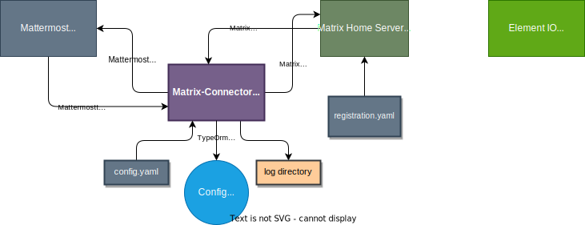

# Deployment guide

## Requirements - Prerequisites

- Mattermost **7.9.1** and above. It is tested with 7.5.1 and 7.9.1, but other new versions will probably work.

- Node **12.22.9** and above. We use version **19.6.0** in development

- Matrix Server
  - A matrix server supporting the Application Services API is needed. No
    attempt has been made to track the minimum supported API version, but it
    should work with any reasonably modern server. It is assumed to be **Synapse Matrix Server**
    in this document.
- Internal configuration database
  - Postgres and Mysql are supported

## Technical Architecture



### Default ports and protocols

All ports can be changed in the configuration file.
| Component|Protocol|Default Port| in config.yaml | Comments |
|:---|:---|:---:|:---|:---|
| Matrix Connector | http |9995 |yes |Only http is tested.|
| Mattermost Server | http(s) |8065| yes| Https is preferred in production.|
| Matrix Home Server | http(s) |8008| yes| Https is preferred in production.|
| Element IO Web| http(s) |8080| yes| Https is preferred in production.|

- Use a reverse proxy in production environment.
- The Matrix Connector is tested with **nginx** as reverse proxy.
- Logging is done with the **log4js** npm package. Configuration for logging is in **config/log4js.json**. See https://www.npmjs.com/package/log4js for detalis.

## Required users in Mattermost and Matrix

| Platform   | User                  | Admin | in config.yaml            | Comments                                                      |
| :--------- | :-------------------- | :---: | ------------------------- | :------------------------------------------------------------ |
| Mattermost | matrix.bridge         |  yes  | **mattermost_bot_userid** | User id in file. Personal access token must be generated      |
| Mattermost | Name of an admin user |  yes  | N/A                       | Good practice to have another system admin user               |
| Mattermost | Normal users          |  no   | N/A                       | Normal users accessing the web UI                             |
| Matrix     | matterbot             |  no   | **matrix_bot.username**   | Application Service main users.Copied to registration.yaml    |
| Matrix     | Name of an admin user |  yes  | **matrix_admin.username** | Admin user used be the connector. Do not login with this user |
| Matrix     | user_admin            |  yes  | N/A                       | An admin user for manage of users in Synapse Admin UI         |
| Matrix     | Normal users          |  no   | N/A                       | Normal users accessing the Element IO web UI                  |

## Synapse Admin - UI

You can use Synapse Admin UI to manage users on a Synapse Matrix Server. A user interface for administration of a Synapse Matrix Server
See here for details https://github.com/Awesome-Technologies/synapse-admin


- It is an application deployed in one of our Docker container
- You access the application with http://localhost:8081 when our docker containers are up and running.
- For public environments can you access the user interface from https://github.com/Awesome-Technologies/synapse-admin.

## Set up

### Installation for development

1. Clone or make a fork of this repository to a directory.
   ```shell
   git clone https://github.com/mattermost/matrix-as-mm.git
   ```
2. Install dependencies and build

   ```shell
   npm ci
   npm run build
   ```

3. Copy `config.sample.yaml` to `config.yaml` and edit accordingly
4. Generate registration file

   ```
   node build/index.js -c config.yaml -f registration.yaml -r
   ```

   - You should regenerate the registration file every time you update **app service** section in the configuration file.
   - You should copy the registration file to synapse start up directory after a change. In our docker environment for development to _./docker/synapse_ .

5. Add the path to the registration file to the `app_service_config_files`
   variable in the synapse configuration file _homeserver.yaml_. Then restart synapse.

6. Start the connector with
   ```
   node build/index.js -c config.yaml -f registration.yaml
   ```
7. Log files. Log files are default located in the **log** directory. The location can changed with -l switch in the command line. The default level for logging is **debug**. It can be changed to **info** with -p switch in the command line.

## Command line for the matrix connector

```bash
janostgren@MBPsomtllhorJan matrix-as-mm % mm-matrix-connector -help
Options:
      --version  Show version number                                   [boolean]
  -f             registration file
                              [string] [required] [default: "registration.yaml"]
  -c             configuration file            [string] [default: "config.yaml"]
  -r             generate registration file                            [boolean]
  -s             Setup/Sync database connection to configuration db    [boolean]
  -a             extended tracing of API calls                         [boolean]
  -p             production mode. Minimal logging                      [boolean]
  -l             log directory                                          [string]
  -h, --help     Show help                                             [boolean]
      ---help

```

### News in version 3.1.1

- Default values for configuration file.
- Default value for registration file.
- Extended tracing is changed from -at to -a . Not backward compatible.
- Use -help or --help to show the help for valid options.

## The configuration file - config.yaml

The configuration file contains all important configurations and must be updated to reflect the run-time environment in development, test and production.

```yaml
homeserver:
  # The url is the url used to talk to your server.
  url: 'http://localhost:8008'

  # The server_name is the part that shows up in @username:server_name. This
  # is usually the domain of the url, but may be different if you use an SRV
  # record or a .well-known URI
  server_name: 'localhost'
  server_type: 'synapse'

appservice:
  # The port the homeserver uses to talk to the appservice (connector). This can
  # be an arbitrary unused port.
  port: 9995

  # The hostname the homeserver uses to talk to the appservice. This hostname
  # should be accessible from the homeserver. If they are on the same server,
  # set it to localhost.
  hostname: host.docker.internal

  # The host the appservice server should bind to. Defaults to hostname
  bind: 0.0.0.0

  schema: http

# URL to the mattermost instance.
mattermost_url: http://localhost:8065/

# If true, the bridge exits if it fails to bridge any channel. Otherwise, it
# will go on bridging the channels it can bridge. The default is false.
forbid_bridge_failure: true

# A puppet matrix user of a real mattermost user with have matrix localpart
# with this prefix.
matrix_localpart_prefix: 'mm_'
# Template for the matrix display name of puppet users. The following
# variables are available:
# - [USERNAME] is the mattermost username
# - [DISPLAY] is the Mattermost display name. This is the concatenation of first
#   and last names if either is set, or the username otherwise.
#
# This is optional and defaults to [DISPLAY]
matrix_display_name_template: '[DISPLAY] [mm]'

# Template for the mattermost usernames of puppet users. The following
# variables are available:
#  - [LOCALPART] is the localpart of the user's id
#  - [DISPLAY] is the matrix display name. If this is not available, the
#    localpart is used.
#
# This is optional and defaults to [DISPLAY]
mattermost_username_template: 'matrix_[LOCALPART]'

# The localpart of the corresponding matrix bot. This is automatically created
# by the bridge.
matrix_bot:
  username: 'matterbot'
  # Optional
  display_name: 'Mattermost Bridge'

# The mattermost bot used by the bridge. This has to be an existing user with
# system administration privileges, in order to verify the emails of the puppet
# users.
#
# Use the username matrix.bridge. The user must have a system admin role
#
mattermost_bot_userid: 'geds3gxhdf81dccdrm8bfx37ry'
mattermost_bot_access_token: 'bxfcapjqiina9xayxw6y65ubwh'
# If password is defined it will be used.
# Password is a base64 encoded string of the users password.
matrix_admin:
  username: '@admin:localhost'
  access_token: 'syt_YWRtaW4_ESjBoGLaWtscFgZHsBhJ_027WFj'
  # password: 'QWRtaW4uLjEyMzQ1Ng=='

# Database configuration. Currently only postgres and mysql are supported.
# The configuration is the arguments supplied to TypeORM's datasource:
# https://typeorm.biunav.com/en/data-source.html#what-is-datasource
database:
  type: postgres
  host: localhost
  database: mm-matrix-bridge
  username: mm-matrix-bridge
  password: hunter2
  # port: 5432

logging: debug # Valid values are trace, debug, info, warn, error and silent

# Matrix users that should not show up on the other side of the bridge. The bot
# user (matterbot) is automatically included.
ignored_matrix_users:
  - '@admin:localhost'
  - '@ignored_user:localhost'

# Same as above. The mattermost bot is also automatically included.
ignored_mattermost_users:
  - 'whida44gqpyfierua1wfrnbxtr'

# Email template used for puppet users, with [RANDOM] replaced by a random
# string. These do not have to be valid emails, as the users have their emails
# automatically verified. However, this can pose a security issue if third
# parties can potentially control these email addresses.
#
mattermost_email_template: 'devnull-[RANDOM]@localhost'
```

### News in version 3.1.1

- You can setup a password to the **matrix_admin** user. If a password is defined the access token is not used. The password is defined as a base64 encoded value.
- Email for a mattermost puppet user is copied from matrix, if it not defined for a existing user in mattermost. This feature works if **server type** is defined as synapse.

## Generate a npm package - tgz file

Generate a npm package file for installation in a target environment.

```shell
npm run package
```

The npm command will generate

- An installable npm package in mm-matrix-connector-**version**.tgz which can be installed with npm install. Install with -g flag for a global installation.
- A zip file called _docker.zip_ containing the docker containers.

Install the connector in a target environment by installing the copied NPM package file (.tgz).

```bash
ubuntu@ip-172-31-3-173:~$ sudo npm -g install mm-matrix-connector-3.1.1.tgz

changed 182 packages, and audited 183 packages in 27s

20 packages are looking for funding
  run `npm fund` for details

found 0 vulnerabilities
ubuntu@ip-172-31-3-173:~$
```

## Installation in a target environment

A target environment can be your test environment or your production environment. In test environments a docker based installation of depended components is preferred.

### Setup the internal configuration database

The connector use an internal database for configuration information. Connection information is described in the _config.yaml_ file. The database can be of type Postgres or MySql.

```yaml
# Database configuration. Currently, only postgres and mysql are supported.
# The configuration is the arguments supplied to TypeORM's datasource:
# https://typeorm.biunav.com/en/data-source.html#what-is-datasource
database:
  type: postgres
  host: localhost
  database: mm-matrix-bridge
  username: mm-matrix-bridge
  password: hunter2
  # port: 5432
```

Run the following command to create the configuration database.

```bash
mm-matrix-connector -c config.yaml -f registration.yaml -s
```

After successful creation of the configuration database the bridge can be started with. All properties in _config.yaml_ must be correct to start the bridge.

```shell
mm-matrix-connector -c config.yaml -f registration.yaml
```

The yaml files should be copied from the global npm directory _(/usr/local/lib/node_modules/mm-matrix-connector)_ before you try to startup .

### Start the Matrix Connector as as a systemd service

You can start the mm-matrix-connector as systemd service in a Linux environment. It is preferred in production environment.
An example is provided in the repository in the _etc_ directory.

```text
[Unit]
Description=Mattermost Matrix Connector
After=network.target
StartLimitIntervalSec=1800
StartLimitBurst=60
[Service]
Restart=on-failure
RestartSec=30
User=ubuntu
WorkingDirectory=/home/ubuntu/matrix/bridge
ExecStart=/usr/local/bin/mm-matrix-connector -c config.yaml -f registration.yaml -p

[Install]
WantedBy=multi-user.target
```

### Output - Requesting service status

```bash
ubuntu@ip-172-31-3-173:~$ sudo systemctl status mm-matrix-connector.service
● mm-matrix-connector.service - Matrix to Mattermost Bridge
     Loaded: loaded (/etc/systemd/system/mm-matrix-connector.service; disabled; vendor preset: enabled)
     Active: active (running) since Thu 2023-03-23 11:46:19 UTC; 34min ago
   Main PID: 128319 (node)
      Tasks: 11 (limit: 1141)
     Memory: 43.3M
        CPU: 2.229s
     CGroup: /system.slice/mm-matrix-connector.service
             └─128319 node /usr/local/bin/mm-matrix-connector -c config.yaml -f registration.yaml -p

Mar 23 11:46:22 ip-172-31-3-173 mm-matrix-connector[128319]: [2023-03-23T11:46:22.798] [INFO] Main - Matrix channel Town Square:town-square mapped matrix room Town >
Mar 23 11:46:22 ip-172-31-3-173 mm-matrix-connector[128319]: [2023-03-23T11:46:22.819] [INFO] Main - Found 1 mappings in database table mappings for private Channel>
Mar 23 11:46:22 ip-172-31-3-173 mm-matrix-connector[128319]: [2023-03-23T11:46:22.819] [INFO] Main -         Channel id=5he9xt3hpprhxqqa8o7etfchuh, Room id=!pfLSMhv>
Mar 23 11:46:23 ip-172-31-3-173 mm-matrix-connector[128319]: [2023-03-23T11:46:23.011] [INFO] MattermostUserStore - Creating matrix puppet @mm_user1.mm:localhost Ma>
Mar 23 11:46:23 ip-172-31-3-173 mm-matrix-connector[128319]: [2023-03-23T11:46:23.166] [INFO] MattermostUserStore - Creating matrix puppet @mm_traum:localhost Matte>
Mar 23 11:46:23 ip-172-31-3-173 mm-matrix-connector[128319]: [2023-03-23T11:46:23.260] [INFO] MattermostUserStore - Creating matrix puppet @mm_traum-member:localhos>
Mar 23 11:46:23 ip-172-31-3-173 mm-matrix-connector[128319]: [2023-03-23T11:46:23.412] [INFO] MattermostUserStore - Creating matrix puppet @mm_fred.luddy:localhost >
Mar 23 11:46:23 ip-172-31-3-173 mm-matrix-connector[128319]: [2023-03-23T11:46:23.539] [INFO] MattermostUserStore - Creating matrix puppet @mm_fred.luddy-admin:loca>
Mar 23 11:46:23 ip-172-31-3-173 mm-matrix-connector[128319]: [2023-03-23T11:46:23.842] [INFO] Main - Number of channels bridged successfully=6. Number of matrix pup>
Mar 23 11:46:23 ip-172-31-3-173 mm-matrix-connector[128319]: Bridge initialized: 1467.674ms
```

### Updating Element configuration in a demo docker environment in AWS or similar

This is not relevant in production environment.

```json
"default_server_config": {
    "m.homeserver": {
      "base_url": "http://ec2-54-216-207-175.eu-west-1.compute.amazonaws.com:8008",
      "server_name": "http://ec2-54-216-207-175.eu-west-1.compute.amazonaws.com:8008"
    },
    "m.identity_server": {
      "base_url": "https://vector.im"
    }
  },

```

In the example above we have deployed the connector at ec2-54-216-207-175.eu-west-1.compute.amazonaws.com. The configuration file is named _element-config.json_.

### Updating the synapse configuration file

You must also update the synapse server configuration file _homeserver.yaml_

```json
public_baseurl: "http://ec2-54-216-207-175.eu-west-1.compute.amazonaws.com:8008"
```

### sd_notify

The bridge attempts to notify `systemd` when it has initialized.
This ensures `systemctl start mm-matrix-connector` will not return
until the bridge is initialized. To configure this, add the following lines to
the `Service` section of the systemd service file:

```
Type=notify
NotifyAccess=all
```

The second line is necessary since we spawn `systemd-notify` to perform the
notification; node doesn't natively support this.

_Note:_ The bridge is considered initialized when all mattermost and matrix
messages in the bridged channels from that point on will be received by the
bridge (barring, e.g. connection issues). Specifically, the bridge is
considered initialized after the mattermost websocket is connected and the
bridge has joined all channels to be bridged.

### Common errors

- `M_UNKNOWN_TOKEN: Invalid macaroon passed`: Service not registered with
  matrix. Make sure you followed the last three steps of the set up
  instructions carefully. In particular, remember to restart synapse.

## Endpoints for the Application service (The bridge)

### Admin endpoint

There is an admin endpoint that lets users interact with the bridge on the http port for the registered matrix application service.
It is specified in the config.yaml and registration.yaml.

### Status endpoint

```
GET /bridge/status
```

The possible replies are

- `initializing` - The connector is initializing
- `running` - The connectoris running

Of course, if the request is made too early in the initialization stage, there
would be no response at all.

### Rename endpoint

```
POST /bridge/rename/:oldName/:newName?access_token=<hs_token>
```

This renames the mattermost puppet with username `:oldName` to `:newName`. The
`hs_token` is the token specified in the registration file.

## Important remarks

### Town Square channel in Mattermost

- By design, every user in a team must join the Town Square room.
- If a matrix user joins a matrix room bridged to a mattermost channel, the puppet user would
  automatically join Town Square of the corresponding team.

- When the user leaves all channels of a team (i.e. all matrix rooms bridged to such channels), the puppet user would leave the team, hence leave Town Square.

### Post deletion

Mattermost and matrix "group" posts in different ways. For example, when
deleting the root post of a thread in Mattermost, the entire thread is deleted.
Similarly, attachments in Mattermost are part of a text message, whereas in Matrix they are separate events.

Our implementation is based on the following two principles:

1.  From the point of view of a single platform, the presence of a bridge should not affect what happens when a post is deleted.

2.  When a post is deleted on a platform, the contents must not be visible on the other platform.

In practice, this means if we delete a message on Matrix, there might be more
posts deleted on Mattermost. These Mattermost deletions will not be reflected on the matrix side, so there will be more messages on Matrix than on Mattermost.

Also, Mattermost does not remember who performed the deletion. Thus, on the matrix side, it is always displayed as the bot user deleting the message.
