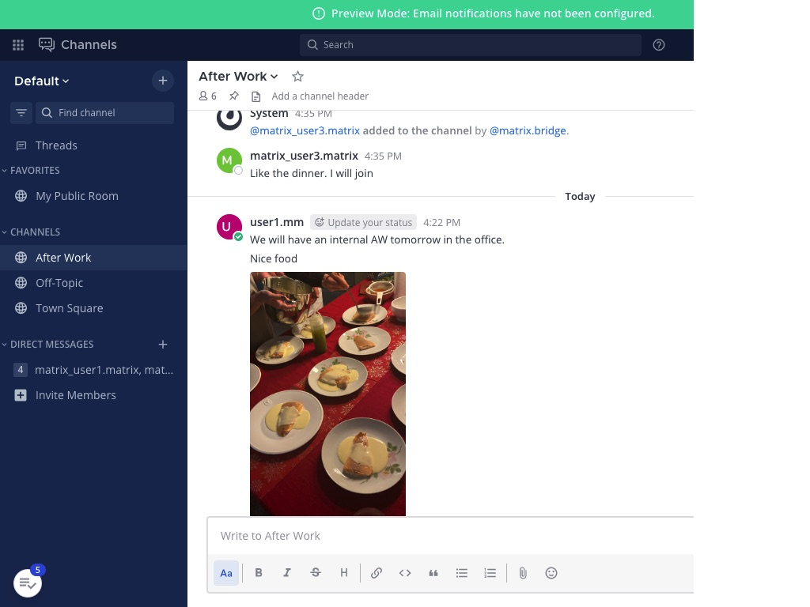
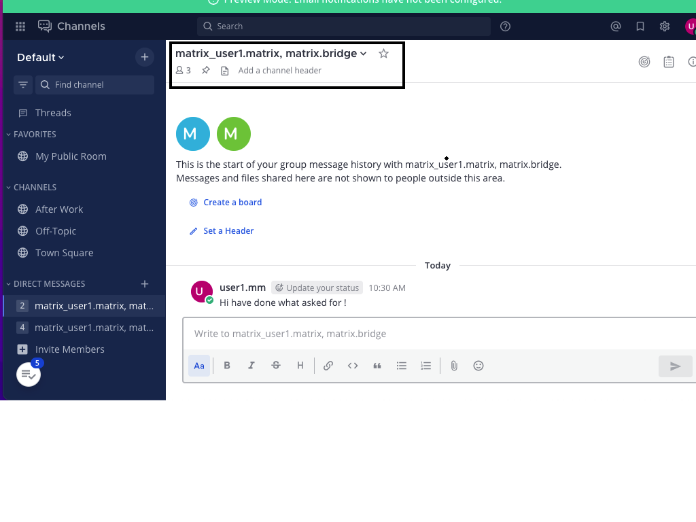
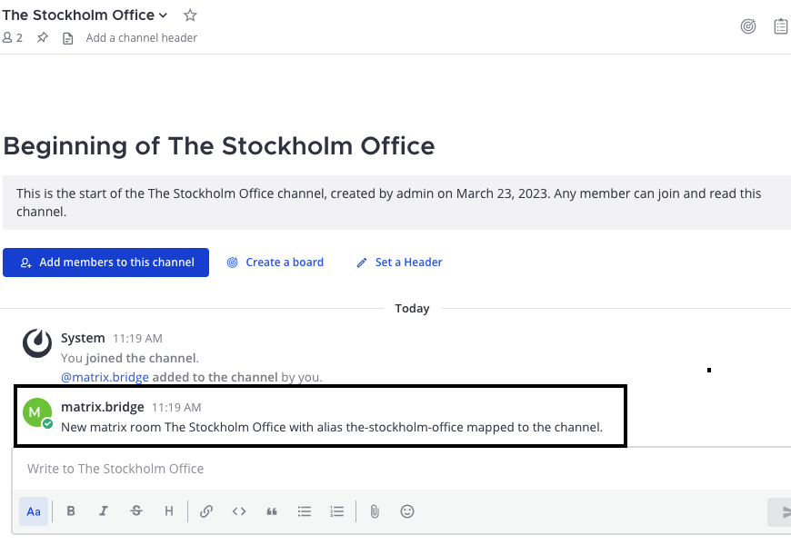
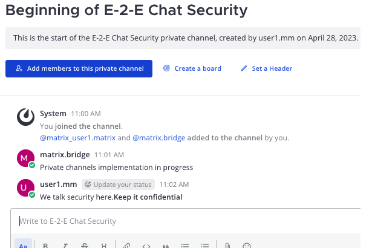
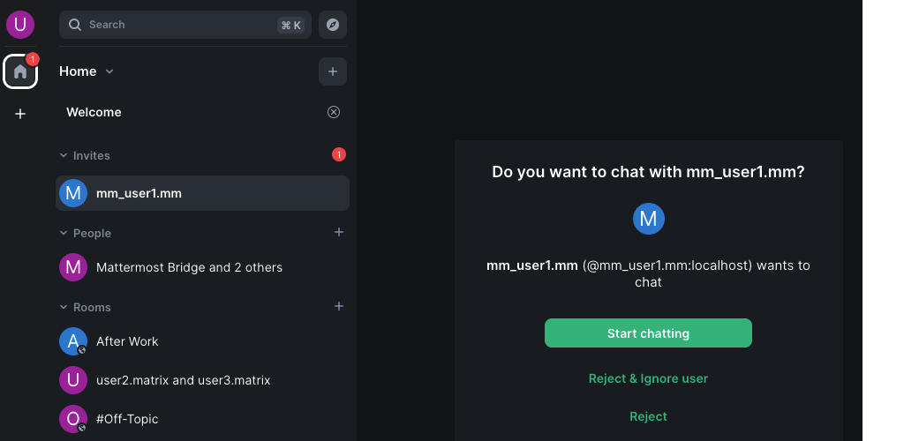
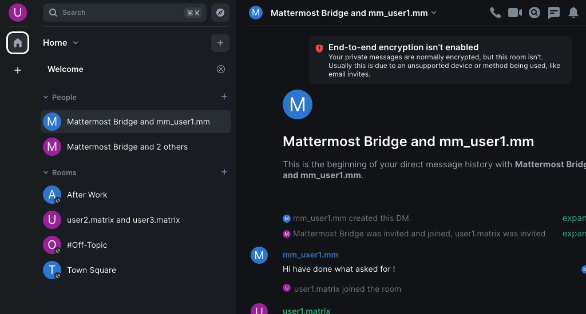
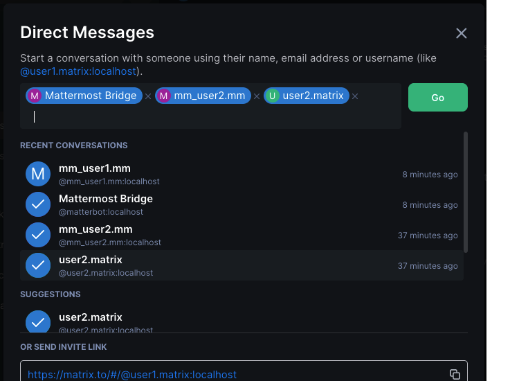
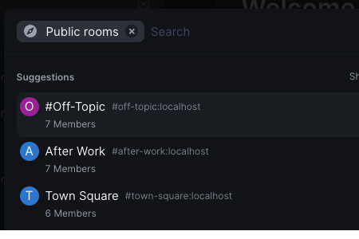
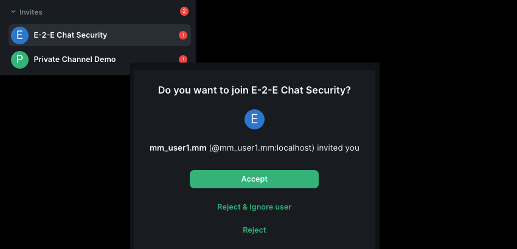

# Use cases for connecting Mattermost and Matrix

## Mattermost UI - Use cases

- Users will use the UI to work with distributed channels exactly in the same ways as working with ordinary public channels and group channels. 
- Public channels for communication with Matrix will be created by admin users in Mattermost.  Only admin users can create these channels.
- The public channels for federation with Matrix must be created in the default team.
- All users can create group channels for direct messaging with Matrix users.
- All users can create private channels for communicating with Matrix users.
- Group channels for direct messaging and private distributed channels must include the *matrix.bridge* user. It is required for communication with Matrix users. 

### Create group channel for chatting with Matrix users

- Create the Direct Message channel in the UI.
- For communication with Matrix you must include matrix users and the *matrix.bridge* user.
- Matrix user has names starting with the prefix *matrix_*. An example matrix_user2.matrix is the user user2.matrix in Matrix. 
- Now this group channel is enabled for communication with Matrix user user2.matrix

### Create a federated(distributed) Public Channel 

- Only user with system admin role can create these channels.
- The channels must be in the **default** team.
- The *matrix.bridge* user must be invited. When this user is invited the mapping to a public room in Matrix is created. 
  
### Create a federated(distributed) Private Channel 

- All users can create these channels.
- The *matrix.bridge* user must be invited. When this user is invited the mapping to a private room in Matrix is created. 

## Matrix (Element) UI - Main use cases

### Direct messaging - Start chat from Mattermost

- Accept the invitation by pressing on **Start chatting** button

### Direct messing - Chatting with mattermost user

- Use the chat room as you do in communication with other Element users. 

### Direct messaging - Start a chat with mattermost users

- You must invite mattermost users and the the special user *Mattermost Bridge*.
- Mattermost users begins with the *mm_* prefix mm_user2.mm is user2.mm in mattermost. 

### Join federated public rooms 

- Just join the public rooms you are interested of.
- The federated public rooms work exactly as normal public rooms

### Join federated private rooms 

- You will get an invitation from the creator of the 🔐 private room.
- The federated private rooms work exactly as normal private rooms.
- 🙁 You cannot create a private federated from Element in this release of the connector.
